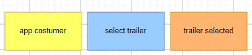
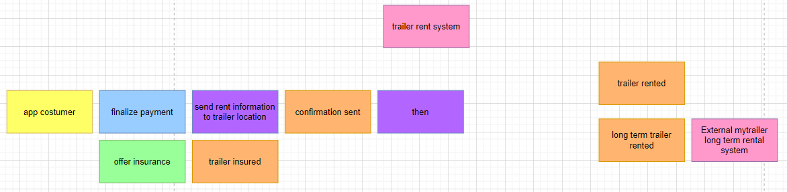

# OLA_Trailer_SysInt

## Event diagram explanation
This is our documentation for our event diagram. 

We have made 7 different diagrams based on the MyTrailer rental case study.

First, we want to explain the color codes we have made:

- Orange: event. This is something that has happened in the system
- Blue: command. This is the command that triggers the stuff after
- Purple: policy. This is a rule that the system follows
- Yellow: actor. This is the actor of the system
- Red: possible problems. This is the possible problems that can happen in the system
- Beige: aggregate
- Green: opportunities. This is the possible changes that can happen in the system
- Pink: external systems. This is made to show the user that the part of the system were looking at, could be/is an external system

### Trailer processes
The first 5 images, is part of the processes that happens when a user wants to rent a trailer.
We have split it into these categories:
- Booking of trailer
- Checkout process
- Long term booking process

#### Booking of trailer
The first diagram is the first part of the interaction, from when the user wants to rent a trailer, to where the user clicks on a trailer with a location

This diagram shows the customer, which in this case is someone who wants to rent a trailer, that searches for trailers. After that, the system finds the available trailers and therefore also the unavailable trailers. The customer then sees the trailers listed, together with the locations of the trailers. This leads to the next part: The trailer selection.

The second diagram is the second part of the interaction, after the users clicks on a trailer with a location, to where the user selects that specific trailer.

This diagram shows the same customer, selecting a trailer and the system now knows that the specific trailer is selected.

#### Checkout process
The third diagram is the third part of the interaction, after a trailer is selected in the system, then the payment process is started.

This diagram shows the user renting a trailer, and then a payment process is started.

The fourth diagram is the fourth part of the interaction, after the payment process is started, then the trailer is rented.

This diagram shows the finalizement of the payment process. In this case, we have a opportunity. The user is getting offered to insure the trailer, and if the user accepts, the trailer is insured and the process proceeds. If he doesnt accept, then the process just proceeds without insurance. The rent information is sent to the trailer location, and then the confirmation gets sent. After that, the trailer is rented.

#### Long term booking process
If it is a long term trailer rent, then the whole process is sent to the external long term booking system, as shown below:

This is an external system, that we dont have to account for. This model shows the long term renter searching for long term packages, then the packages is listed together with the trailer locations.

### Payment systems
After this, we have two different payment systems: The trailer return late fee system and the trailer payment system for advertisement. 

#### Late fee system
The first payment system, the trailer return late fee system, is if the trailer renter havent returned the trailer in time, then a late fee is added. 

This image shows the renter returning the trailer, and the system checking if it is returned late. If it has been returned too late, the late fee is added and the fee is withdrawn from the customer, and then the process continues. Otherwise, the process just continues, and the trailer is returned as usual and the confirmation gets sent to the customer.

#### Payment system for advertisement
The second payment system, the trailer payment system for advertisement, is the system that allows business partners like Fog and Jem & Fix to advertise on the trailers. The business partners pay for advertisement, and in return the trailer company puts ads on the trailers and stores the trailers at the business partners locations.

The images shows the trailer location customers ( for example Fog ), that stores the trailers, and then the system makes custom advertisements for the trailers at the locations. The locations/customers ( Fog ) then pays for the advertisements, and the payment is provided to the system.

